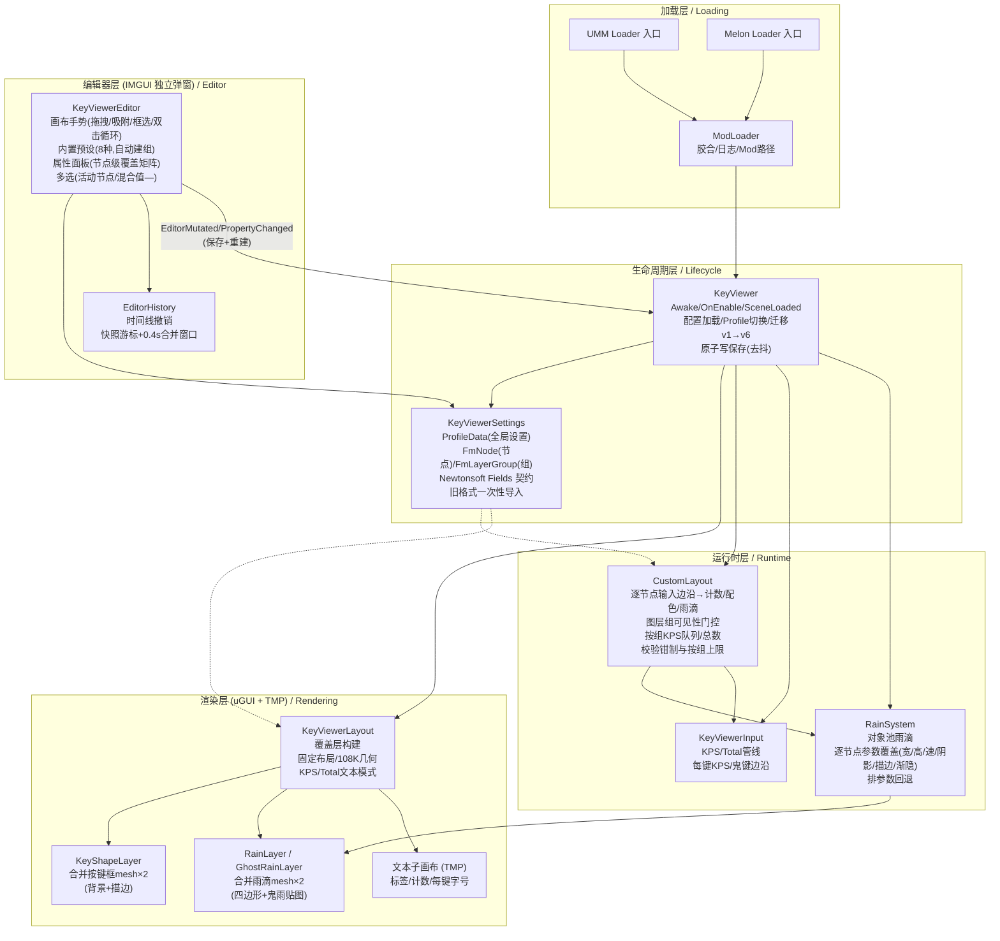
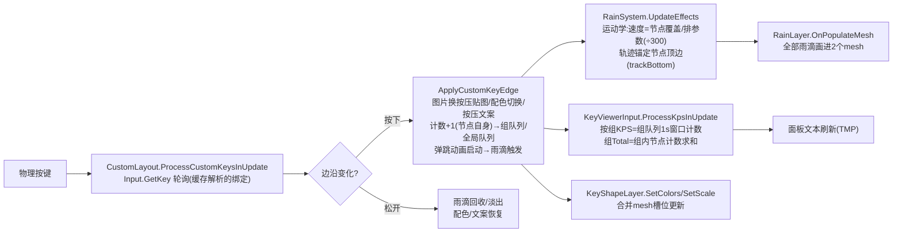

# JipperKeyViewer 项目文档 / Project Documentation


[](https://github.com/2228293026/JipperKeyViewer/releases/latest)
[](https://github.com/2228293026/JipperKeyViewer/actions/workflows/build.yml)

> 一款适用于《A Dance of Fire and Ice》的按键显示 Mod：实时按键、KPS 统计、雨滴特效，以及完整的 FreeMake 自定义布局编辑器。
> A keyboard overlay mod for **A Dance of Fire and Ice**: real-time key display, KPS counters, rain effects, and a full FreeMake custom-layout editor.

## 1. 项目概览 / Overview

本仓库是一个 C# Mod 工程，包含：A C# mod project containing:

- 单一变体 Mod（默认资源 DEFLATE 内嵌 DLL，首启自释放），支持 UnityModManager 与 MelonLoader 双加载器 / single variant with DLL-embedded default assets, UnityModManager & MelonLoader
- 固定布局按键显示（8K–24K / 108 键全键盘 / 脚键 2K–16K）/ fixed layouts (8K–24K, 108-key, foot keys 2K–16K)
- FreeMake 自定义布局编辑器（节点式、IMGUI 独立弹窗、内置预设、图层组）/ FreeMake node editor (IMGUI window, presets, layer groups)
- 合并网格渲染的按键框与雨滴系统（对象池、热路径零 GC）/ merged-mesh rendering with pooling, zero hot-path GC

核心信息 / Key facts:

| 项 / Item | 值 / Value |
|---|---|
| 目标游戏 / Target game | A Dance of Fire and Ice (Unity `6000.3.10f1`, Mono) |
| 语言 / Language | C# 9 (LangVersion 9, SDK-style csproj) |
| 目标框架 / Target | .NET Framework 4.8.1 |
| 加载器 / Loaders | UnityModManager 0.33+ / MelonLoader |
| 持久化 / Persistence | Newtonsoft.Json 13.0.2 (game-shipped) + JsonUtility (meta only) |
| 界面 / UI | Unity IMGUI (editor/settings) + uGUI/TMP (overlay) |
| 许可证 / License | MIT |

## 2. 环境要求 / Prerequisites

- **.NET SDK** — 目标框架引用程序集由 csproj 自动还原，无需装 4.8.1 Developer Pack / reference assemblies auto-restored, no Developer Pack needed
- `libs/` 目录下的引用 DLL（游戏程序集 + Newtonsoft + 加载器 API）/ reference DLLs under `libs/`
- Git

## 3. 快速开始 / Quick Start

```bash
git clone https://github.com/adofaiex/JipperKeyViewer.git
cd JipperKeyViewer

# 生成内嵌默认资源（gitignored 构建输入，全新克隆必跑一次） / generate embedded assets (gitignored build input — run once per fresh clone)
./tools/Pack-EmbeddedAssets.ps1

# 构建 / build
dotnet build JipperKeyViewer/JipperKeyViewer.csproj -c Release
```

将 `bin/Release` 产物连同 Loader 入口、`Info.json` 拷入游戏的 `Mods/`（见 §9）——无需任何资源文件，首次启动自动释放到 `assets/` / Copy outputs + loader entries + `Info.json` into the game's `Mods/` folder (see §9) — no asset files needed, they self-extract to `assets/` on first launch.

## 4. 目录结构 / Repository Layout

```text
JipperKeyViewer/
├─ JipperKeyViewer/                    # 共享核心源码树（由主工程链接编译） / shared core source tree (linked into the mod project)
│  └─ KeyViewer/
│     ├─ Core/                         # Runtime core / 运行时核心
│     │  ├─ KeyViewer.cs               # Lifecycle, config/profile management, migrations / 生命周期、配置管理、版本迁移
│     │  ├─ KeyViewerInput.cs          # Input polling, KPS/Total pipelines (per-group) / 输入轮询、KPS/Total 管线（按组）
│     │  ├─ KeyViewerLayout.cs         # Overlay construction, fixed layouts, 108K geometry / 覆盖层构建、固定布局、108K 几何
│     │  ├─ CustomLayout.cs            # FreeMake runtime: per-node input/count/rain, groups, caps / FreeMake 运行时
│     │  └─ Key.cs                     # Per-key runtime state / 每键运行时状态
│     ├─ Settings/                     # Data model / 数据模型
│     │  ├─ KeyViewerSettings.cs       # ProfileData/FmNode/FmLayerGroup + Newtonsoft persistence / 数据模型与持久化
│     │  ├─ KeyviewerStyle.cs          # Layout enums / 布局枚举
│     │  └─ FootKeyviewerStyle.cs      # Foot-key enums / 脚键枚举
│     ├─ Editor/                       # FreeMake editor / FreeMake 编辑器
│     │  ├─ KeyViewerEditor.cs         # IMGUI editor window / 编辑器弹窗
│     │  └─ EditorHistory.cs           # Timeline undo (snapshot cursor) / 时间线撤销
│     ├─ GUI/                          # Settings window partials / 设置窗口各页
│     │  └─ KeyViewerGUI.cs / KeyViewerSettingsGUI / KeyViewerColorGUI / KeyViewerRainGUI / KeyViewerBindingGUI
│     ├─ Rendering/                    # Merged meshes / 合并网格渲染
│     │  ├─ KeyShapeLayer.cs           # Key-box meshes (bg + outline) / 按键框 mesh
│     │  └─ RainLayer.cs               # Rain meshes (quads + ghost sprite) / 雨滴 mesh
│     ├─ Rain/                         # Rain simulation / 雨滴模拟
│     │  ├─ RainSystem.cs              # Pooled simulation, per-node overrides / 对象池模拟、逐节点覆盖
│     │  └─ RawRain.cs                 # Per-drop data record & kinematics / 单滴数据与运动学
│     ├─ Loader/                       # Loading glue / 加载胶合
│     │  ├─ ModLoader.cs               # Loader glue & logging / 加载器胶合与日志
│     │  └─ KeyViewerResources.cs      # Unified resource loading + embedded-asset self-extract / 统一资源加载与内嵌资源自释放
│     └─ Util/                         # Shared utilities / 共享工具
│        ├─ I18n.cs                    # EN/ZH/KO strings / 三语词条
│        └─ KvImageLoader.cs           # Reflection PNG loader (shared) / 反射 PNG 加载器
├─ JipperKeyViewer/                    # 主工程（源码树 + 内嵌默认资源 + Info.json） / the mod project
├─ JipperKeyViewer.Loader.UMM/         # UMM loader entry / UMM 加载入口
├─ JipperKeyViewer.Loader.Melon/       # Melon loader entry / Melon 加载入口
├─ libs/                               # Reference DLLs / 引用 DLL
└─ CHANGELOG.md / 更新日志.md
```

## 5. 包与依赖 / Dependencies

- **游戏程序集 / Game assemblies**: `UnityEngine.*` (CoreModule/UIModule/IMGUIModule/InputLegacyModule…), `Assembly-CSharp`, `Unity.TextMeshPro`; `System.IO.Compression`（内嵌资源解压，Unity Mono 自带 / embedded-asset decompression, shipped by Unity Mono）
- **序列化 / Serialization**: `Newtonsoft.Json` — resolved from the game's Managed dir at runtime; `libs/` copy for compile time
- **加载器 API / Loader APIs**: `UnityModManager`, `MelonLoader`, `0Harmony` (loader entries only — the core project does not depend on Harmony / 仅加载器入口引用，主工程不依赖 Harmony)
- 无 NuGet 运行时依赖；`Microsoft.NETFramework.ReferenceAssemblies` 自动还原 / no NuGet runtime deps; reference assemblies auto-restored

## 6. 脚本分层与核心系统关系图 / Layering & System Diagram

> 工作分层用于快速定位，不是强制架构边界。 / Working layers for orientation, not enforced boundaries.

### 分层说明 / Layers

- **加载层 / Loading**: Loader entries (UMM/Melon) → inject the core DLL → `ModLoader` glue & logging
- **生命周期层 / Lifecycle**: `KeyViewer` — Awake/Enable/SceneLoaded/Quit; config load, profile switching, migrations v1→v6
- **编辑器层 / Editor**: `KeyViewerEditor` (IMGUI window) + `EditorHistory` — touches only the data model, never rendering directly
- **运行时层 / Runtime**: `CustomLayout` (per-node input/counting) + `KeyViewerInput` (KPS/Total pipelines) + `RainSystem` (rain simulation)
- **渲染层 / Rendering**: `KeyViewerLayout` (overlay construction) + `KeyShapeLayer`/`RainLayer` (merged meshes) + TMP text sub-canvas
- **数据层 / Data**: `KeyViewerSettings` — ProfileData / FmNode / FmLayerGroup + Newtonsoft Fields contract

### 核心系统关系图 / System diagram



### 核心数据流：一次按键（自定义布局）/ Data flow: one keypress (custom layout)



### 配置持久化流 / Persistence flow

```text
编辑器操作 / 设置页改动
  → EditorMutated / SaveSettingsFromGui（去抖合并 / debounced）
  → SyncListsToArrays（列表刷入数组字段 / flush lists to arrays）
  → JsonConvert.SerializeObject（Fields 契约 + UnityStructConverter）
  → WriteAllTextSafe（临时文件 + 原子替换 / temp + atomic replace）

游戏启动 / Game start
  → LoadSettings（meta 用 JsonUtility）
  → LoadProfile（Newtonsoft PopulateObject + 旧格式一次性导入 / legacy import）
  → EnsureCustomNodes（NaN 净化 / 钳制 / 按组上限 / 空组剔除）
```

## 7. 模块职责矩阵 / Module Matrix

| 模块 / Module | 主要职责 / Responsibility | 备注 / Notes |
|---|---|---|
| `Editor/KeyViewerEditor.cs` | 画布手势、预设生成、属性面板、图层组管理 / canvas gestures, presets, property panel, groups | 最大单文件 / largest file |
| `Core/KeyViewerLayout.cs` | 覆盖层构建、108K 槽位表、CreateKey 管线 / overlay build, 108K slot table | 105 项槽位表 |
| `Core/CustomLayout.cs` | FreeMake 运行时全部逻辑 / full FreeMake runtime | partial |
| `Settings/KeyViewerSettings.cs` | 数据模型 + 序列化 / data model + serialization | FmNode 79 字段 / fields |
| `Rain/RainSystem.cs` | 雨滴池/模拟/参数覆盖 / rain pool, sim, overrides | — |
| `Editor/EditorHistory.cs` | 撤销栈 / undo stack | ~100 行 / lines |

## 8. FreeMake 编辑器速览 / FreeMake Editor Quick Reference

布局页切到**自定义** → **打开 FreeMake 编辑器**。独立浮动窗，改动即时生效。/ Switch the layout to **Custom**, click **Open FreeMake Editor** — an independent floating window; edits apply live.

| 能力 / Feature | 说明 / Details |
|---|---|
| 画布 / Canvas | 拖拽/框选/Ctrl多选/双击循环/八向缩放/小地图/滚轮缩放/右键平移/方向键微调 / drag, marquee, Ctrl multi-select, double-click cycle, 8-way resize, minimap, wheel zoom, RMB pan, arrow nudge |
| 吸附 / Snapping | 节点边/中心 + 屏幕边/中心，屏幕恒定阈值；Alt 临时关闭 / node & screen edges/centers, screen-constant; Alt disables |
| 撤销 / Undo | Ctrl+Z/Y，含属性修改；连续调整按 0.4s 窗口合并为一步 / includes property edits; bursts coalesce |
| **内置预设 / Presets** | 12K/16K/20K/10K/8K/14K/24K/108K；「保存为新配置」（默认）或**追加进当前画布**；继承键位/计数/文本；自动建图层组 / save as new profile (default) or add into current canvas; inherits bindings/counts/texts; auto-creates a layer group |
| **图层组 / Layer groups** | 整组显隐（隐藏=不渲染不响应不计数）；**按组 KPS/Total**；每组一对面板；**按组预算 112 键类 + 8 图片**；空组自动清理；组名复用最小空闲编号 / group visibility gates everything; per-group KPS/Total; one panel pair per group; per-group budgets 112+8; empty groups pruned; names reuse free numbers |
| **节点级覆盖 / Per-node overrides** | 配色六件套、文本、雨滴形状、雨滴样式、**鬼雨独立三组**、动画、面板文本布局、杂项 / colors ×6, text, rain shape, rain style, ghost rain ×3 sets, animations, panel text layout, misc |
| 多选编辑 / Multi-select | 字段显示活动节点值（青色框标注），改动应用全选；混合值显示 `—` / shows active node (cyan frame), applies to all; mixed values show `—` |
| 图片 / Images | `CustomImages/` 或绝对路径；窗口内导入；按压图切换 / from `CustomImages/` or absolute; in-window import; pressed-image swap |

## 9. 安装布局 / Installation Layouts

### UnityModManager

```text
UMMMods/JipperKeyViewer/
├── JipperKeyViewer.dll
├── JipperKeyViewer.Loader.UMM.dll             # Info.json 引用的入口 / entry referenced by Info.json
└── Info.json
```

### MelonLoader

```text
Mods/JipperKeyViewer/
├── JipperKeyViewer.dll
├── JipperKeyViewer.Loader.Melon.dll
└── Info.json
```

不再随包分发资源文件：默认贴图/字体 DEFLATE 内嵌于主 DLL，首次启动自动释放到 `assets/`（已存在的文件——包括用户替换过的——永不覆盖）。 / No asset files ship with the package: default sprites/fonts are deflated inside the main DLL and self-extract to `assets/` on first launch (existing files — including user replacements — are never overwritten).

首次启动后创建 `config/`（`settings.json` + `profiles/` 每配置一个 JSON，游戏内切换）；`CustomFont/` 放字体，`CustomImages/` 放 FreeMake 图片。/ First launch creates `config/` (meta + one JSON per profile, switchable in-game); fonts in `CustomFont/`, FreeMake images in `CustomImages/`.

## 10. 常见问题排查 / FAQ

**Profile 变成 `*.corrupt` / 配置丢失**：不可解析文件会先备份为 `.corrupt` 再回退默认，不会覆盖原件；旧过渡格式自动导入。/ Unparseable files are backed up as `.corrupt` before falling back; legacy interim formats import automatically.

**旧版本 Mod 读到 Custom 配置 / Old builds reading a Custom profile**：按枚举钳制回落 Key16，属预期。/ Clamped back to Key16 by design.

**自定义布局雨滴异常 / Odd rain behavior in custom layouts**：逐节点速度与排滑杆同单位；手改配置写入的 0/NaN 加载时自动净化。/ Per-node speeds share the row-slider unit; hand-edited 0/NaN values are sanitized at load.

## 11. 许可证 / License

- **MIT License** — see [LICENSE](./LICENSE.txt).
